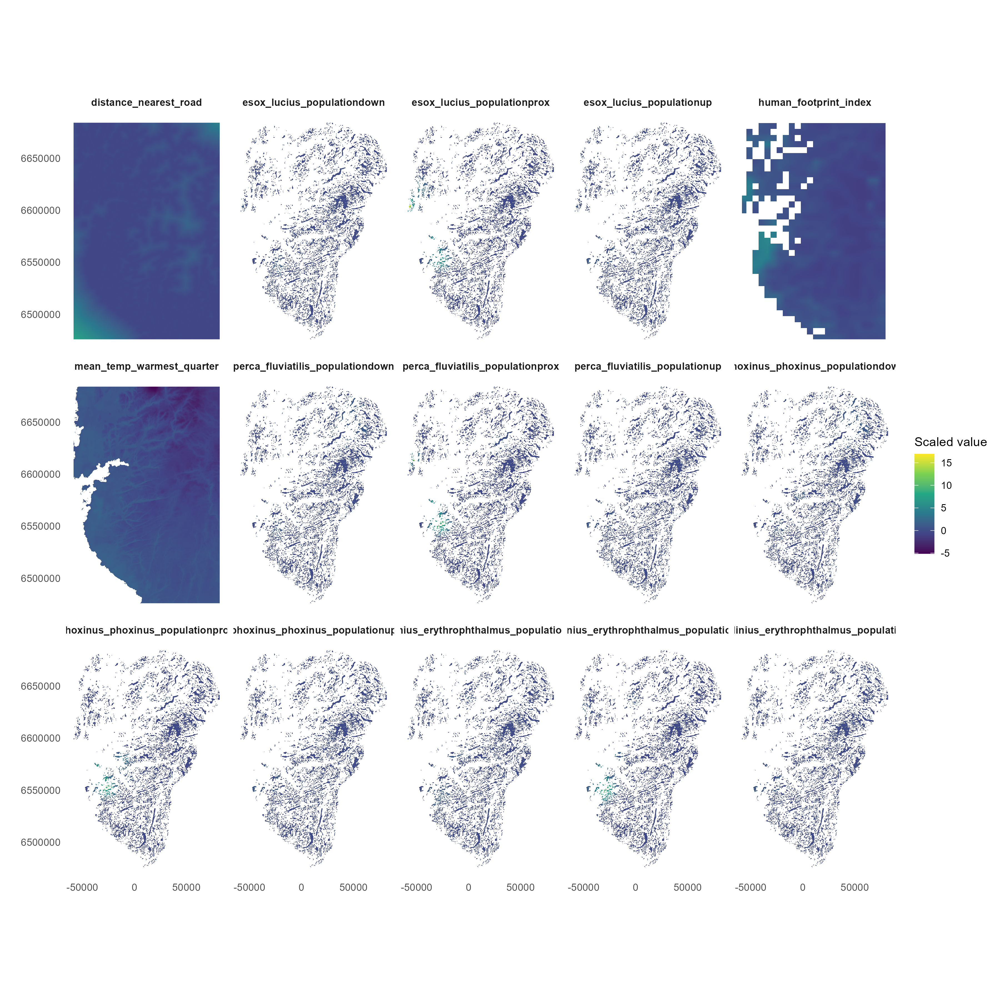

# Introduction

Four fish species were considered: 

    - Esox lucius (northern pike), 
    - Perca fluviatilis (European perch), 
    - Phoxinus phoxinus (Eurasian minnow), and 
    - Scardinius erythrophthalmus (common rudd). 
    
# Preparing data

## Occurrence data

Two complementary data sources were used: 

- environmental DNA (eDNA) data, processed as presence–absence observations, and 
- occurrence records obtained from the Global Biodiversity Information Facility (GBIF).
```{r tbl-dataSummary}
#| echo: false

library(dplyr)

data <- readr::read_csv(
  "data/species_occurrence_summary.csv"
)
knitr::kable(
  data %>%
    dplyr::select(Species, eDNA, GBIF, Total),
  caption = "Number of occurrence records for each fish species in the eDNA and GBIF datasets."
)
```

We summarise the number of occurrence records for each fish species in the eDNA and GBIF datasets are presented in @tbl-dataSummary. There are very few data used available for the modelling, witha maximum of 23 occurrence records and minimum of 17 records.

## Covariates

To predict the occurrence probability, we obtained a set of covariates to use for the modelling:

- Mean temperature for the warmest quarter (`mean_temp_warmest_quarter`)
- Human footprint index (`human_footprint_index`)
- Distance to the nearest road (`distance_nearest_road`)
- Species specific population proximity (`_ _populationprox`)
- Species specific population up (`_ _populationup`)
- Species specific population down (`_ _populationdown`)
```{r fig-predictors}
#| fig-cap: 'The open-lowland ecosystem area in Norway.'
#| out-width: 100%
#| echo: false
#| warning: false

```

The distribution of the predictors are presented in @fig-predictors.