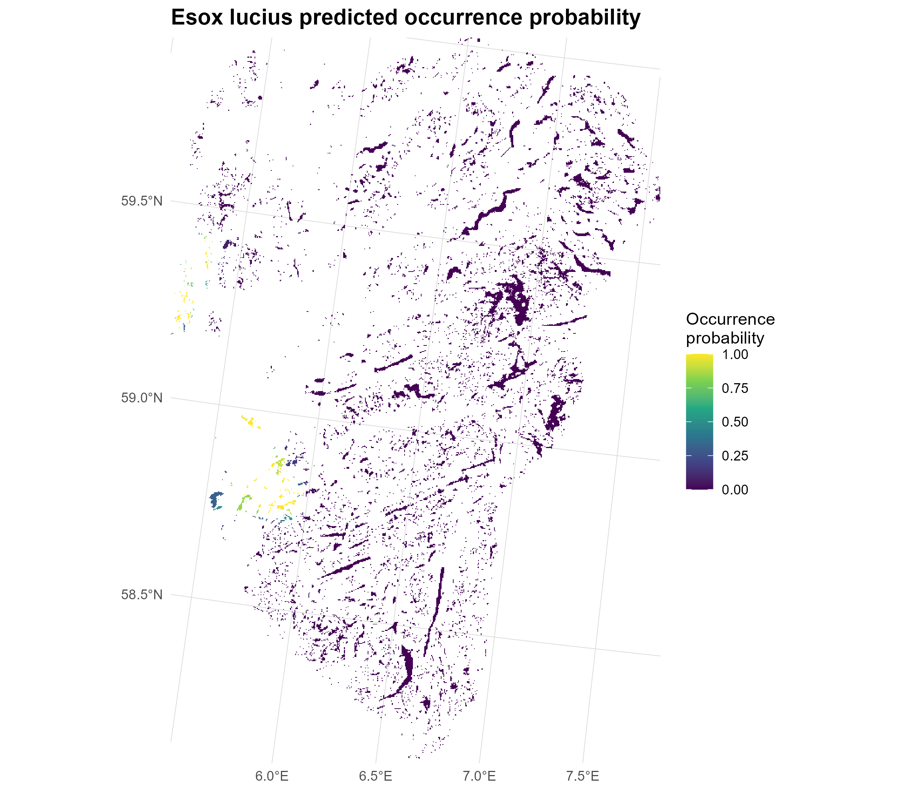

# Introduction

Four fish species were considered: 

    - Esox lucius (northern pike), 
    - Perca fluviatilis (European perch), 
    - Phoxinus phoxinus (Eurasian minnow), and 
    - Scardinius erythrophthalmus (common rudd). 
    
# Preparing data

## Occurrence data

Two complementary data sources were used: 

- environmental DNA (eDNA) data, processed as presence–absence observations, and 
- occurrence records obtained from the Global Biodiversity Information Facility (GBIF).
```{r tbl-dataSummary}
#| echo: false

library(dplyr)

data <- readr::read_csv(
  "data/species_occurrence_summary.csv"
)
knitr::kable(
  data %>%
    dplyr::select(Species, eDNA, GBIF, Total),
  caption = "Number of occurrence records for each fish species in the eDNA and GBIF datasets."
)
```

We summarise the number of occurrence records for each fish species in the eDNA and GBIF datasets are presented in @tbl-dataSummary. There are very few data used available for the modelling, witha maximum of 23 occurrence records and minimum of 17 records.

## Covariates

To predict the occurrence probability, we obtained a set of covariates to use for the modelling:

- Mean temperature for the warmest quarter (`mean_temp_warmest_quarter`)
- Human footprint index (`human_footprint_index`)
- Distance to the nearest road (`distance_nearest_road`)
- Species specific population proximity (`_ _populationprox`)
- Species specific population up (`_ _populationup`)
- Species specific population down (`_ _populationdown`)
```{r fig-predictors}
#| fig-cap: 'Covariates used in fitting the model.'
#| out-width: 100%
#| echo: false
#| warning: false
knitr::include_graphics("img/predictors.png")
```

The distribution of the predictors are presented in @fig-predictors.

# Model fitting and prior sensitivity checks

## Model fitting

### Function for fitting models
We fitted the models using `PointedSDMs` R-package. We created a function `fit_esox_model()` that takes the names of predictors (`predictor_names`), the prior distribution for the fixed effects (`prior_settings`), the spatial prior distribution (`spatial_prior`), the datasets (`datasets`), the coariate rasters (`selected_predictors`), the spatial mesh (`mesh`), the boundary for the model fit (`lake_boundary`), the coordinate reference system (`target_crs`) and the formula for the bias field (`bias_formula`).

```{r functionForFittingModels}
#| eval: false

fit_esox_model <- function(
    predictor_names,
    prior_settings,
    spatial_prior = list(
      prior.range = c(50, 0.01),
      prior.sigma = c(1, 0.01)
    ),
    datasets,
    selected_predictors,
    mesh,
    lake_boundary,
    target_crs,
    bias_formula
) {

  # --------------------------------------------------------------------------
  # Construct predictor formula
  # --------------------------------------------------------------------------

  if (length(predictor_names) == 0) {

    predictor_formula <- ~ 1

  } else {

    predictor_formula <- as.formula(
      paste(
        "~",
        paste(
          predictor_names,
          collapse = " + "
        )
      )
    )
  }


  # --------------------------------------------------------------------------
  # Initialise model
  # --------------------------------------------------------------------------

  model <- startISDM(

    datasets,

    spatialCovariates = selected_predictors,

    Projection = target_crs$wkt,

    Mesh = mesh,

    Boundary = lake_boundary,

    responsePA = "present",

    pointsIntercept = TRUE,

    pointsSpatial = "shared",

    Formulas = list(
      covariateFormula = predictor_formula,
      biasFormula = bias_formula
    )
  )


  # --------------------------------------------------------------------------
  # Spatial prior
  # --------------------------------------------------------------------------

  model$specifySpatial(

    sharedSpatial = TRUE,

    constr = TRUE,

    prior.range = spatial_prior$prior.range,

    prior.sigma = spatial_prior$prior.sigma
  )


  # --------------------------------------------------------------------------
  # Intercept prior
  # --------------------------------------------------------------------------

  model$priorsFixed(

    Effect = "Intercept",

    mean.linear = prior_settings$Intercept$mean,

    prec.linear = prior_settings$Intercept$prec
  )


  # --------------------------------------------------------------------------
  # Predictor priors
  # --------------------------------------------------------------------------

  if (length(predictor_names) > 0) {

    for (pred in predictor_names) {

      # Only apply a prior if one has been specified
      if (pred %in% names(prior_settings)) {

        model$priorsFixed(

          Effect = pred,

          mean.linear = prior_settings[[pred]]$mean,

          prec.linear = prior_settings[[pred]]$prec
        )
      }
    }
  }


  # --------------------------------------------------------------------------
  # Fit model
  # --------------------------------------------------------------------------

  fit <- fitISDM(

    model,

    options = list(

      control.inla = list(
        int.strategy = "eb"
      ),

      control.compute = list(
        dic = TRUE,
        waic = TRUE,
        cpo = TRUE,
        return.marginals.predictor = TRUE
      ),

      verbose = FALSE
    )
  )


  # --------------------------------------------------------------------------
  # Extract WAIC
  # --------------------------------------------------------------------------

  waic_value <- NA_real_

  if (!is.null(fit$waic$waic)) {
    waic_value <- fit$waic$waic
  }


  list(
    model = model,
    fit = fit,
    waic = waic_value,
    predictors = predictor_names,
    priors = prior_settings
  )
}
```

### Mesh creation

To fit the spatial models, we first construct a spatial mesh using the `fm_mesh_2d()` function from the **fmesher** R package. A spatial mesh is a set of interconnected points (vertices) that divides the study area into a network of small triangular elements. This discretisation provides a computational representation of the continuous spatial domain and allows the spatially varying process to be approximated at a finite number of locations. The mesh is then used to model spatial dependence between nearby locations and to represent the spatial random field in the subsequent analysis.

```{r meshCreation}
#| eval: false

# ==============================================================================
# 4. Create mesh
# ==============================================================================
# Make sure you have one point for each lake
mesh_pts <- dataForSpp %>%
  sf::st_point_on_surface() %>%
  dplyr::select(lake_id, geometry) %>%
  dplyr::distinct(lake_id, .keep_all = TRUE)

mesh <- fm_mesh_2d(
  loc = st_geometry(mesh_pts),
  loc.domain = lake_boundary,
  max.edge = c(10000, 15000),
  cutoff = 1000,
  crs = target_crs
)

# Inspect mesh
plot(mesh)
plot(
  st_geometry(lake_boundary),
  add = TRUE,
  border = "red"
)
points(
  st_coordinates(mesh_pts),
  pch = 16,
  cex = 0.5
)
```

## Prior sensitvity analysis

We assessed the sensitivity of model results to the choice of prior distributions by fitting the model under a set of predefined prior scenarios. 

```{r}
#| eval: false
#| 
prior_scenarios <- list(

  # --------------------------------------------------------------------------
  # Prior 1: relatively weak / diffuse
  # --------------------------------------------------------------------------

  weak = list(

    Intercept = list(
      mean = 0,
      prec = 0.1
    ),

    temperature = list(
      mean = 0,
      prec = 0.1
    ),

    HFI = list(
      mean = 0,
      prec = 0.1
    ),

    popnProx = list(
      mean = 0,
      prec = 0.1
    ),

    popnDown = list(
      mean = 0,
      prec = 0.1
    ),

    popnUp = list(
      mean = 0,
      prec = 0.1
    )
  ),


  # --------------------------------------------------------------------------
  # Prior 2: your current priors
  # --------------------------------------------------------------------------

  current = list(

    Intercept = list(
      mean = 0,
      prec = 1
    ),

    temperature = list(
      mean = 0,
      prec = 1
    ),

    HFI = list(
      mean = 0,
      prec = 1
    ),

    popnProx = list(
      mean = 0,
      prec = 1
    ),

    popnDown = list(
      mean = 0,
      prec = 1
    ),

    popnUp = list(
      mean = 0,
      prec = 1
    )
  ),


  # --------------------------------------------------------------------------
  # Prior 3: moderately informative
  # --------------------------------------------------------------------------

  moderate = list(

    Intercept = list(
      mean = 0,
      prec = 10
    ),

    temperature = list(
      mean = 0,
      prec = 10
    ),

    HFI = list(
      mean = 0,
      prec = 10
    ),

    popnProx = list(
      mean = 0,
      prec = 10
    ),

    popnDown = list(
      mean = 0,
      prec = 10
    ),

    popnUp = list(
      mean = 0,
      prec = 10
    )
  ),


  # --------------------------------------------------------------------------
  # Prior 4: stronger shrinkage
  # --------------------------------------------------------------------------

  strong = list(

    Intercept = list(
      mean = 0,
      prec = 0.001
    ),

    temperature = list(
      mean = 0,
     prec = 0.001
    ),

    HFI = list(
      mean = 0,
     prec = 0.001
    ),

    popnProx = list(
      mean = 0,
     prec = 0.001
    ),

    popnDown = list(
      mean = 0,
     prec = 0.001
    ),

    popnUp = list(
      mean = 0,
     prec = 0.001
    )
  )
)


spatial_prior <- list(

  prior.range = c(
    50,
    0.01
  ),

  prior.sigma = c(
    1,
    0.01
  )
)
```

Each scenario specified a different set of prior settings for the model parameters, while keeping the predictor variables, spatial prior, datasets, spatial mesh, study-area boundary, coordinate reference system, and bias formulation constant. This allowed us to evaluate whether model fit was sensitive to the assumptions made about the prior distributions.

```{r priorSensitvity}
#| eval: false

prior_results <- vector(
  "list",
  length(prior_scenarios)
)

names(prior_results) <- names(prior_scenarios)


for (i in seq_along(prior_scenarios)) {

  scenario_name <- names(prior_scenarios)[i]

  message(
    "\n====================================================\n",
    "Fitting prior scenario: ",
    scenario_name,
    "\n===================================================="
  )

  prior_results[[i]] <- fit_esox_model(

    predictor_names = all_predictors,

    prior_settings = prior_scenarios[[i]],

    spatial_prior = spatial_prior,

    datasets = datasets,

    selected_predictors = selected_predictors,

    mesh = mesh,

    lake_boundary = lake_boundary,

    target_crs = target_crs,

    bias_formula = bias_formula
  )
}


# ==============================================================================
# 20. Compare prior scenarios
# ==============================================================================

prior_comparison <- dplyr::bind_rows(

  lapply(
    names(prior_results),

    function(x) {

      data.frame(

        prior = x,

        WAIC = prior_results[[x]]$waic,

        predictors = paste(
          prior_results[[x]]$predictors,
          collapse = " + "
        ),

        stringsAsFactors = FALSE
      )
    }
  )
) %>%

  dplyr::arrange(WAIC)


prior_comparison


# Select best prior names
best_prior_name <- prior_comparison$prior[1]

best_prior_name

best_prior <- prior_results[[best_prior_name]]

best_prior$waic

write.csv(
  prior_comparison,
  file = file.path(
    pathToResults,
    "prior_sensitivity_WAIC.csv"
  ),
  row.names = FALSE
)
```

For each prior scenario, the model was fitted using the `fit_esox_model()` function. The fitted model, together with its WAIC value and the predictor variables included in the model, was stored in a named list. The models were then compared using the Watanabe–Akaike information criterion (WAIC), with lower WAIC values indicating better expected out-of-sample predictive performance among the fitted models.

The WAIC values for all prior scenarios were combined into a comparison table and sorted in ascending order. The prior scenario with the lowest WAIC was subsequently selected for the final model. The resulting comparison table was also saved as `prior_sensitivity_WAIC.csv` to provide a record of the prior sensitivity analysis and the basis for selecting the prior specification used in subsequent analyses.

```{r tbl-priorSensitivity}
#| echo: false

library(dplyr)

data <- readr::read_csv(
  "data/esox/prior_sensitivity_WAIC.csv"
)
knitr::kable(
  data %>%
    dplyr::select(-any_of(c("n_predictors", "model_id"))),
  caption = "The combination of predictors used in the variable selection for Northern pike, the WAIC value and the change in WAIC from the model with the lowest WAIC"
)
```

The weak priors with intercept and covariate effects having a Normal distribution with mean $0$ and variance $100$ (@tbl-priorSensitivity). 

## Variable selection

We evaluated alternative combinations of the candidate explanatory variables to identify the predictor set providing the best model fit. All possible non-empty combinations of the candidate predictors were generated using `combn()`. This resulted in a set of models ranging from single-predictor models to the full model containing all candidate predictors.

```{r}
#| eval: false

predictor_combinations <- unlist(
  lapply(
    seq_along(all_predictors),
    function(k) {
      combn(
        all_predictors,
        k,
        simplify = FALSE
      )
    }
  ),
  recursive = FALSE
)

length(predictor_combinations)


# ==============================================================================
# 22. Variable-selection analysis
# ==============================================================================

variable_results <- vector(
  "list",
  length(predictor_combinations)
)


for (i in seq_along(predictor_combinations)) {

  current_predictors <- predictor_combinations[[i]]

  predictor_label <- paste(
    current_predictors,
    collapse = " + "
  )

  message(
    "\n====================================================\n",
    "Model ",
    i,
    " / ",
    length(predictor_combinations),
    "\nPredictors: ",
    predictor_label,
    "\n===================================================="
  )

  variable_results[[i]] <- fit_esox_model(

    predictor_names = current_predictors,

    prior_settings = selected_prior_settings,

    spatial_prior = spatial_prior,

    datasets = datasets,

    selected_predictors = selected_predictors,

    mesh = mesh,

    lake_boundary = lake_boundary,

    target_crs = target_crs,

    bias_formula = bias_formula
  )
}


# ==============================================================================
# 23. Compare variable combinations
# ==============================================================================

variable_comparison <- dplyr::bind_rows(

  lapply(

    seq_along(variable_results),

    function(i) {

      predictors_i <-
        variable_results[[i]]$predictors


      data.frame(

        model_id = i,

        predictors = if (
          length(predictors_i) == 0
        ) {

          "Intercept only"

        } else {

          paste(
            predictors_i,
            collapse = " + "
          )
        },

        n_predictors = length(predictors_i),

        WAIC = variable_results[[i]]$waic,

        stringsAsFactors = FALSE
      )
    }
  )
) %>%

  dplyr::arrange(WAIC)


best_variable_id <-
  variable_comparison$model_id[1]


best_predictors <-
  variable_results[[best_variable_id]]$predictors


variable_comparison <- variable_comparison %>%

  dplyr::mutate(

    delta_WAIC =
      WAIC - min(WAIC, na.rm = TRUE)

  ) %>%

  dplyr::arrange(WAIC)


write.csv(
  variable_comparison,
  file = file.path(
    pathToResults,
    "variable_selection_WAIC.csv"
  ),
  row.names = FALSE
)
```

Each predictor combination was fitted using the `fit_esox_model()` function. The selected prior specification from the prior sensitivity analysis was used for all models, while the spatial prior, datasets, spatial mesh, study-area boundary, coordinate reference system, and bias formulation were held constant. Thus, differences among models were attributable to the set of predictors included in the fixed-effects component.

For each fitted model, we recorded the predictor variables included in the model, the number of predictors, and the corresponding WAIC value. The models were then ranked according to WAIC, with lower values indicating better expected predictive performance. We also calculated the difference in WAIC between each model and the model with the lowest WAIC (`ΔWAIC`).

The predictor combination associated with the lowest WAIC was selected as the predictor set for subsequent analyses. The complete model comparison, including the model identifier, predictor combination, number of predictors, WAIC, and ΔWAIC, was saved as `variable_selection_WAIC.csv`.

```{r tbl-variableSelection}
#| echo: false

library(dplyr)

data <- readr::read_csv(
  "data/esox/variable_selection_WAIC.csv"
)
knitr::kable(
  data %>%
    dplyr::select(-any_of(c("n_predictors", "model_id"))),
  caption = "The combination of predictors used in the variable selection for Northern pike, the WAIC value and the change in WAIC from the model with the lowest WAIC"
)
```

The model with the lowest WAIC for the Northern pike is one with HFI and popnProx as covariates (@tbl-variableSelection).

# Spatial prediction and mapping

Following model selection, we generated spatial predictions for the lakes included in the analysis. One prediction location was defined for each unique lake by selecting a point on the lake surface using `st_point_on_surface()`. Predictions were generated from the fitted PointedSDMs model using the `predict()` function, requesting the model's linear predictor on the link scale.

```{r}
#| eval: false

################################################################################
# Convert PointedSDMs linear predictor to probability and plot as raster
################################################################################
# ==============================================================================
# One prediction point per lake
# ==============================================================================

lake_prediction_points <- dataForModelling %>%
  dplyr::filter(scntfcN %in% sppOfInt) %>%
  dplyr::select(lake_id, geometry) %>%
  dplyr::distinct(lake_id, .keep_all = TRUE) %>%
  st_point_on_surface()

esox_prediction <- predict(
  esox_fit,
  data = lake_prediction_points,
  predictor = TRUE,
  fun = "linear"
)

# ==============================================================================
# 1. Extract predictions
# ==============================================================================

predictions <- esox_prediction$predictions

predictions <- sf::st_as_sf(predictions)

# Check
names(predictions)
nrow(predictions)
st_crs(predictions)


# ==============================================================================
# 2. Convert linear predictor to occurrence probability
# ==============================================================================

# PointedSDMs model uses a complementary log-log link.
#
# Inverse cloglog:
#
#   p = 1 - exp(-exp(eta))
#
# where eta is the linear predictor.

predictions <- predictions %>%
  mutate(
    probability = 1 - exp(-exp(mean))
  )


# Check probability
summary(predictions$probability)

range(
  predictions$probability,
  na.rm = TRUE
)


# ==============================================================================
# 3. Create one polygon per lake
# ==============================================================================

lakes <- dataForModelling %>%
  dplyr::filter(
    scntfcN %in% sppOfInt
  ) %>%
  dplyr::select(
    lake_id,
    geometry
  ) %>%
  dplyr::distinct(
    lake_id,
    .keep_all = TRUE
  )


# ==============================================================================
# 4. Make sure CRS is identical
# ==============================================================================

lakes <- st_transform(
  lakes,
  st_crs(predictions)
)


# ==============================================================================
# 5. Join predictions to lake polygons
# ==============================================================================

lakes_pred <- lakes %>%
  left_join(
    predictions %>%
      st_drop_geometry() %>%
      dplyr::select(
        lake_id,
        mean,
        sd,
        q0.025,
        q0.5,
        q0.975,
        probability
      ),
    by = "lake_id"
  )


# ==============================================================================
# 6. Check prediction coverage
# ==============================================================================

prediction_coverage <- lakes_pred %>%
  sf::st_drop_geometry() %>%
  summarise(
    total_lakes = n(),
    predicted_lakes = sum(!is.na(probability)),
    missing_lakes = sum(is.na(probability)),
    proportion_predicted =
      mean(!is.na(probability))
  )

print(prediction_coverage)


# ==============================================================================
# 7. Create raster template
# ==============================================================================

prediction_template <- selected_predictors[[1]]

# Ensure template has the same CRS
# terra::crs(prediction_template)


# ==============================================================================
# 8. Convert lake polygons to SpatVector
# ==============================================================================

lakes_vect <- terra::vect(lakes_pred)


# ==============================================================================
# 9. Rasterize occurrence probability
# ==============================================================================

probability_raster <- terra::rasterize(
  lakes_vect,
  prediction_template,
  field = "probability",
  fun = "mean",
  background = NA
)

# names(probability_raster) <- "Esox_lucius_probability"


# ==============================================================================
# 10. Save probability raster
# ==============================================================================

probability_file <- file.path(
  pathToResults,
  "occurrence_probability.tif"
)

terra::writeRaster(
  probability_raster,
  probability_file,
  overwrite = TRUE,
  wopt = list(
    datatype = "FLT4S",
    gdal = c("COMPRESS=LZW")
  )
)

cat(
  "\nProbability raster saved to:\n",
  probability_file,
  "\n"
)


# ==============================================================================
# 11. Rasterize linear predictor as well
# ==============================================================================

linear_raster <- terra::rasterize(
  lakes_vect,
  prediction_template,
  field = "mean",
  fun = "mean",
  background = NA
)

names(linear_raster) <- "linear_predictor"


# ==============================================================================
# 12. Save linear predictor raster
# ==============================================================================

linear_file <- file.path(
  pathToResults,
  "linear_predictor.tif"
)

terra::writeRaster(
  linear_raster,
  linear_file,
  overwrite = TRUE,
  wopt = list(
    datatype = "FLT4S",
    gdal = c("COMPRESS=LZW")
  )
)

cat(
  "\nLinear predictor raster saved to:\n",
  linear_file,
  "\n"
)

# ==============================================================================
# 11. Plot raster
# ==============================================================================
p <- ggplot() +
  
  tidyterra::geom_spatraster(
    data = probability_raster
  ) +
  
  scale_fill_viridis_c(
    name = "Occurrence\nprobability",
    limits = c(0, 1),
    na.value = "transparent"
  ) +
  
  # Rogaland boundary
  # geom_sf(
  #   data = study_region,
  #   fill = NA,
  #   colour = "black",
  #   linewidth = 0.6
  # ) +
  
  # Individual lake boundaries
  # geom_sf(
  #   data = lakes,
  #   fill = NA,
  #   colour = "grey60",
  #   linewidth = 0.15
  # ) +
  
  coord_sf(
    crs = st_crs(25833),
    expand = FALSE
  ) +
  
  labs(
    title = paste(sppOfInt,"predicted occurrence probability"),
    x = NULL,
    y = NULL
  ) +
  
  theme_minimal() +
  
  theme(
    panel.grid.major = element_line(
      colour = "grey85",
      linewidth = 0.2
    ),
    panel.grid.minor = element_blank(),
    legend.position = "right",
    plot.title = element_text(
      face = "bold",
      size = 14
    )
  )


ggsave(plot = p,
       filename = file.path(pathToResults,
                            "occ_plot.pdf"),
       units = "in",
       height = 7,
       width = 8)

ggsave(plot = p,
       filename = file.path(pathToResults,
                            "occ_plot.png"),
       units = "in",
       height = 7,
       width = 8)

```

The resulting predictions included the posterior mean and standard deviation of the linear predictor, together with the corresponding posterior quantiles. Because the model uses a complementary log-log (cloglog) link, the posterior mean of the linear predictor was transformed to the occurrence-probability scale using the inverse cloglog transformation:

$$
p = 1-\exp\{-\exp(\eta)\},
$$

where \(p\) is the predicted occurrence probability and \(\eta\) is the linear predictor. This transformation produces predicted occurrence probabilities bounded between 0 and 1.

The predictions were subsequently joined to the corresponding lake polygons using the unique `lake_id`. We assessed prediction coverage by calculating the total number of lakes, the number of lakes with available predictions, the number of lakes without predictions, and the proportion of lakes for which predictions were obtained.

To facilitate spatial visualisation and subsequent analyses, the lake-level occurrence probabilities were rasterised using the first layer of the selected predictor raster as the spatial template. The lake polygons were rasterised using the predicted occurrence probability as the rasterisation field. Where necessary, values were aggregated using the mean. The resulting raster therefore represents the predicted occurrence probability across the spatial extent of the prediction template, with cells outside the predicted lake polygons assigned `NA`.

In addition to the occurrence-probability raster, the posterior mean of the linear predictor was rasterised and retained as a separate spatial layer. Both rasters were stored as GeoTIFF files using single-precision floating-point data and LZW compression.

```{r fig-esoxOccurrencePlot}
#| fig-cap: 'Covariates used in fitting the model.'
#| out-width: 100%
#| echo: false
#| warning: false

```

Finally, the occurrence-probability raster was visualised as a spatial map, with the colour scale constrained to the interval 0–1 to represent the full range of possible occurrence probabilities. The resulting maps were exported in both PDF and PNG formats for subsequent reporting and visualisation.


